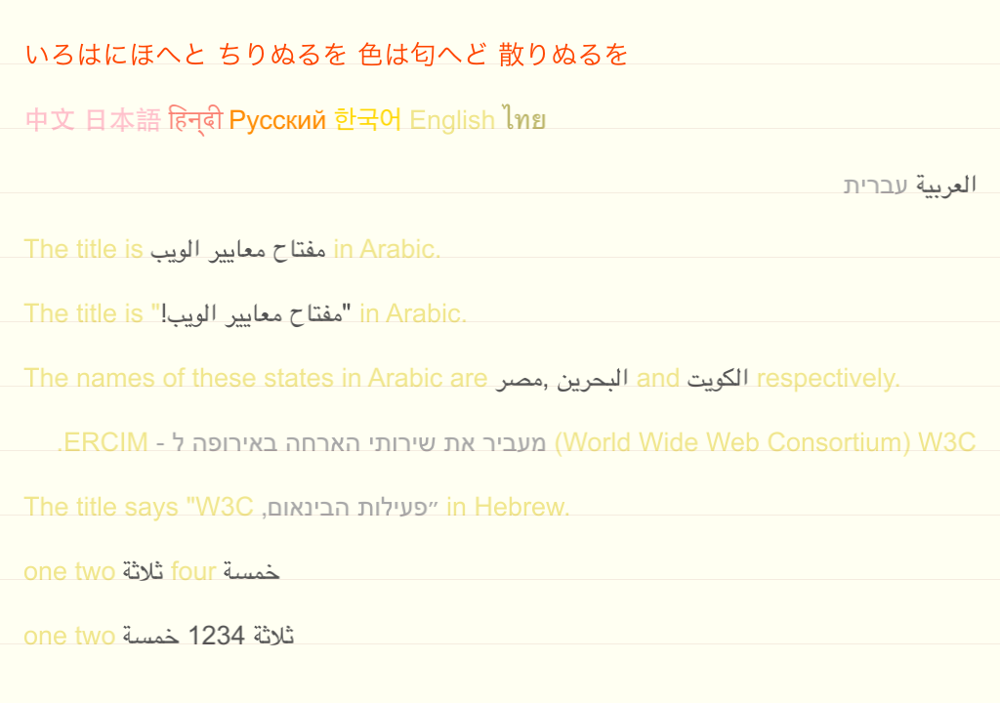

12. BIDI
========

**Features**

Script and language itemization taking place together with BIDI. The 3 first lines are described in detail in the [ScriptDetector](https://github.com/arielm/Unicode/tree/master/Projects/ScriptDetector) project. The 7 last lines are described in detail in the [SimpleBIDI](https://github.com/arielm/Unicode/tree/master/Projects/SimpleBIDI) project.  

**Remarks**

1. The algorithm for merging the items is from the [Mapnik project](https://github.com/mapnik/mapnik/blob/64d5153aeaeb1c9e736bfead297dfea39b066d2c/src/text/itemizer.cpp). Action is taking place in the [TextItemizer class](src/TextItemizer.cpp) (note that we're not currently handling *style items*...)

2. Take a look at the quotation marks in line 3 from the bottom: do you see how the right double-quotes are considered as Hebrew while the left ones are considered as English? Check the [fonts used](resources/SansSerif-osx.xml) to render this screenshot: *Arial.ttf* is used for english, and *ArialHB.ttf* for Hebrew. The problem is that the double-quotes glyph look different in the two fonts. Wouldn't it be preferable if both double-quotes would be rendered as English?

  The problem is that the [algorithm we use for script detection](http://source.icu-project.org/repos/icu/icu/trunk/source/extra/scrptrun) is not *pairing* double-quotes together (unlike, say, parentheses, or a [few other symbols](https://github.com/arielm/Unicode/blob/master/Projects/BIDI/src/scrptrun.cpp#L23-41).) Pretty consistent afterall with the associated README: *"the support for paired punctuation is only a prototype. A complete implementation will be added to ICU in the future."*
  
  But then, how can it be that quotation are fine marks in line 6 from the bottom? The reason is that *Geeza Pro.ttf*, which we use for Arabic, does not contain punctuation glyphs. Therefore, the [font-fallback system](https://github.com/arielm/Unicode/tree/master/Projects/ShapingFallback) is picking the next font in the set for Arabic (i.e. *Arial.ttf*) for rendering both double-quotes.
  
  This practice, by the way, has been generalized on Android, where, for example, the Arabic or Hebrew fonts never contain punctuation nor numbers. So in order to solve our previous *Hebrew and double-quotes problem* on OSX or iOS, we could enforce a similar behavior by **adding to the font-fallback system a mean to exclude (or include-only) certain glyphs**.
