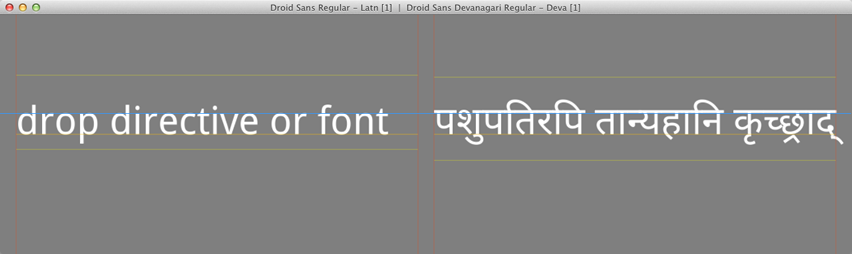

FontComparator
--------------

**Features**

1. Comparing two fonts.
2. Tweaking the scale of one font relative to the other.

**Instructions**

1. Drag-and-drop some directive file from the project's [assets/directives](assets/directives) folder in one of the left or right slots.
2. Or a font (.ttf or .otf) from the repository's [assets/fonts](https://github.com/arielm/Unicode/tree/master/fonts) folder or from anywhere else on your system.
3. Press the mouse to control an horizontal guide-line.
4. Change the right-slot's font scale via mouse-wheel or the UP/DOWN keys.
5. Reset the right-slot's font scale by pressing ENTER.

Installation instructions and more at https://github.com/arielm/Unicode

**Creating symbolic links to access your system's fonts via the Finder on OSX 10.7 and 10.8**

`mkdir ~/Documents/Fonts`  
`ln -s /Library/Fonts/* ~/Documents/Fonts`  
`ln -s /System/Library/Fonts/* ~/Documents/Fonts`  

**Remarks**

1. Rendering is not optimized.
2. Straightforward scaling and mipmaps are used (instead of rasterizing for each point-size...)
