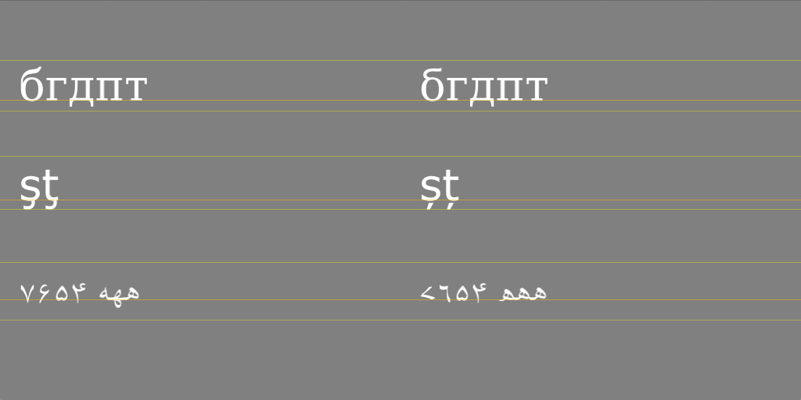

LanguageFeatures
----------------

I was not sure about the necessity to specify a *language* when peforming shaping with Harfbuzz so I asked [this question](http://www.mail-archive.com/harfbuzz@lists.freedesktop.org/msg03194.html) in the mailing list. The answer is that it can make a difference, as demonstrated in this project:  

**Russian vs Cyrillic**  
It works only for the first letter, with *DejaVuSerif.ttf* (version 2.34)  
Reference: https://bugs.webkit.org/show_bug.cgi?id=37984

**English vs Romanian**  
It works as intended, with *Verdana.ttf* (version installed on OSX 10.8.5)  
Reference: http://en.wikipedia.org/wiki/Pango  

**Arabic vs Sindhi**  
It works as intended, with *ScheherazadeRegOT.ttf* but not with *Scheherazade-R.ttf* (version 2.010)  
Reference: http://scripts.sil.org/cms/scripts/page.php?item_id=Scheherazade  

