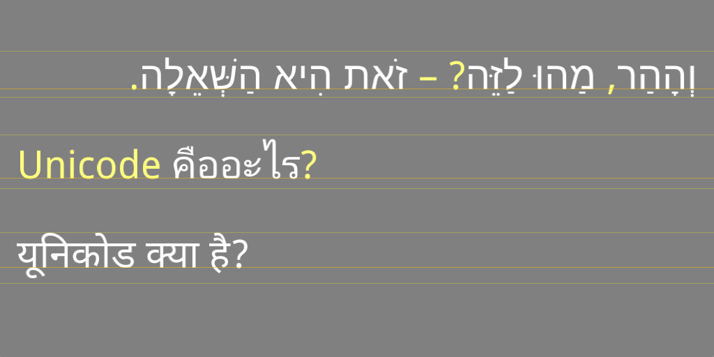

ShapingFallback
---------------

On the Android platform, the DroidSans family consists of [several files](https://github.com/arielm/Unicode/tree/master/fonts), each containing a limited characters set.  

For example, *DroidSansHebrew-Regular.ttf* (30KB) only handles Hebrew letters and diacritics, while *DroidSans.ttf* (191KB) handles punctuation, Latin, Greek and Cyrillic letters. Finally, and unlike its name, *DroidSansFallback.ttf* (3.9MB) handles punctuation, Latin and CJK characters, but not Hebrew nor many other languages...

This project is therefore demonstrating a system capable of renderering text-spans made of a single script and language, using a list of fonts.  

**Span 1**  
Font 1: DroidSansHebrew-Regular.ttf (white). Used for Hebrew letters and diacritics.  
Font 2: DroidSans.ttf (yellow). Used for punctuation.  

**Span 2**  
Font 1: DroidSansThai.ttf (white). Used for Thai letters and diacritics.  
Font 2: DroidSans.ttf (yellow). Used for Latin letters and punctuation.  

**Span 3**  
Font 1: DroidSansDevanagari-Regular.ttf. Used for Hindi letters, diacritics and punctuation.  
Font 2: DroidSans.ttf. Not used.

**Remarks**  

1. This is a work in progress, following [this thread](http://www.mail-archive.com/harfbuzz@lists.freedesktop.org/msg03191.html) in Harfbuzz mailing-list.  

2. This [class from the Mapnik project](https://github.com/mapnik/mapnik/blob/64d5153aeaeb1c9e736bfead297dfea39b066d2c/include/mapnik/text/harfbuzz_shaper.hpp) served as a starting-point. On one side, the code is more complete than ours because it handles itemization (script and BIDI), but on the other side, font fallback seems to be implemented in a very limited fashion (as far as I understand, it's not possible to mix glyphs from different fonts, as we do...)

3. Rendering is not optimized (consider each of the projects in this repository as an iteration...)
