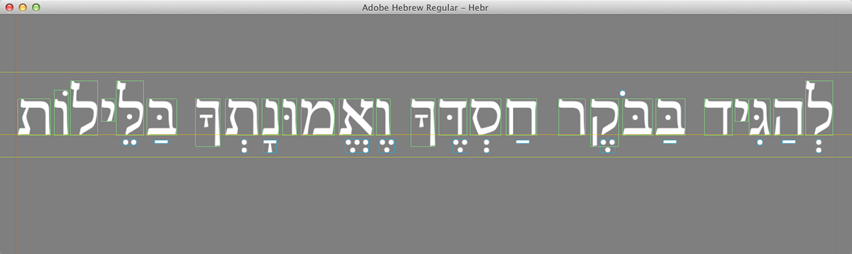

ShapingMetrics
--------------

**Features**

1. Rendering of a single-line of shaped text, properly scaled to fit the viewport.
2. Showing a bounding-box around each glyph: regular characters in green; non-spacing-marks in blue.

**Instructions**

1. Drag-and-drop some directive file from the project's [assets/directives](assets/directives) folder.
2. Or a font (.ttf or .otf) from the repository's [assets/fonts](https://github.com/arielm/Unicode/tree/master/fonts) folder or from anywhere else on your system.
3. Press ENTER to toggle bounding-boxes.

Installation instructions and more at https://github.com/arielm/Unicode  

Executable available for OSX: [v1.0.0](https://github.com/arielm/Unicode/releases/download/v1.0.0/Unicode-1.0.0.zip)

**Creating symbolic links to access your system's fonts via the Finder on OSX 10.7 and 10.8**

`mkdir ~/Documents/Fonts`  
`ln -s /Library/Fonts/* ~/Documents/Fonts`  
`ln -s /System/Library/Fonts/* ~/Documents/Fonts`  

**Remarks**

1. Rendering is not optimized.
2. Straightforward scaling and mipmaps are used (instead of rasterizing for each point-size...)
