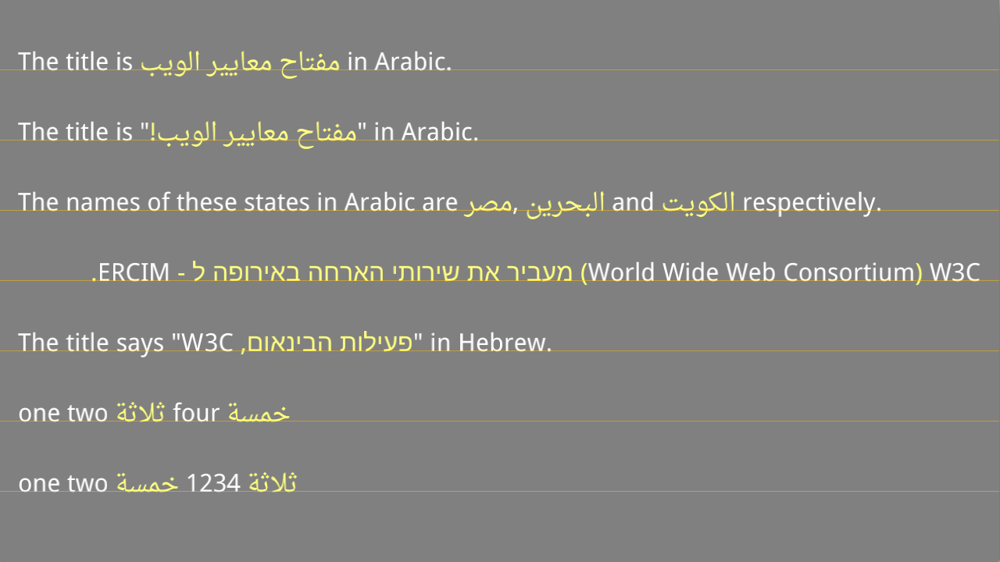

SimpleBIDI
----

Using text examples from [what you need to know about the bidi algorithm and inline markup](http://people.w3.org/rishida/scripts/bidi). RTL text runs are rendered in yellow. 

**Features**

1. Simple BIDI reordering: takes some text with *major script and language* and *overall direction* and splits it into runs (reordering will be effectively performed only for RTL scripts.)

2. Line layout: takes a list of text-runs ands shapes them with Harfbuzz (including *font fallback*) into ready-to-be-rendered clusters (made of one or more glyphs.)

**Remarks**

1. We rely on [ICU 52.1](http://www.icu-project.org/apiref/icu4c/ubidi_8h.html) for BIDI (properly tested on OSX, iOS and Android.)

2. See [Test.h](src/Test.h) for a comparision between the two ways of using ICU BIDI which served as a base for [our implementation](src/TextGroup.cpp#L17-42). Note that this is appropriate only for one-liners (performing BIDI together with line-breaking is [partially demonstrated]((http://www.icu-project.org/apiref/icu4c/ubidi_8h.html#details) here.)

3. Lines 1, 2, 3, 6 and 7 are shaped entirely as Arabic while lines 4 and 5 are shaped entirely as Hebrew (what we meant by *major script and language*.) Therefore, the LTR text will not be shaped as English. In practice, this is OK for mixing English with the languages in question, but the preferred approach would be to perform [*script itemization*](https://github.com/arielm/Unicode/blob/d38431b694c576758532c57f074392da3b36b20d/Projects/ScriptDetector/src/Application.cpp) prior to BIDI ([demonstrated alongside with *style itemization*](https://github.com/mapnik/mapnik/blob/64d5153aeaeb1c9e736bfead297dfea39b066d2c/src/text/itemizer.cpp) in the Mapnik project...)

4. Line 4 is *forced* to RTL, while the other lines are *forced* to LTR (what we meant by *overall direction*.) Note that a line can definitely contain *runs* of different directions, but the point is that we can't rely on ICU for determining the *default paragraph direction* (otherwise, line 4 would have been treated as LTR, which is is obviously not the case.)

5. In lines 2 and 5, we use Unicode control character U+200F (aka *RLM* or *RIGHT-TO-LEFT MARK*) in order to get the RTL punctuation (in yelllow) in the right place.

6. Font fallback is necessary (as demonstrated in our [ShapingFallback](https://github.com/arielm/Unicode/tree/66e18d060096f0bec563af75ce360bcb5976c105/Projects/ShapingFallback) project) in order to render the RTL punctuation in lines 2, 4, and 5.
